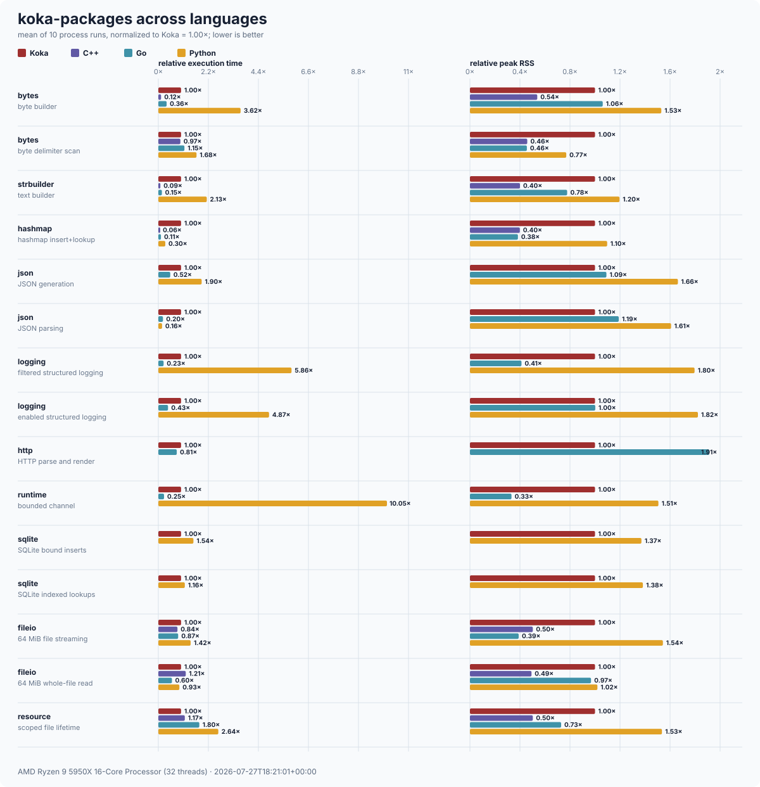

# koka-packages

Foundational Koka libraries for the Milestone-4 reference service.  Each
directory is a separate package with its own `koka.toml`, its own `README.md`,
its own tests and its own benchmark; they depend on each other by path.

Everything here is used by the reference service.  Nothing here is general
ecosystem work, and each package's README says what it deliberately is not
before it says what it is.

| package | what it is | README |
| --- | --- | --- |
| `kktest` | assertions, grouped tests, watchdogs, temporary paths, composable property generators with shrinking, and benchmark helpers | [kktest/README.md](kktest/README.md) |
| `bytes` | immutable byte sequences, searching and splitting, strict UTF-8/hex conversion, builders, integer codecs, and hashing | [bytes/README.md](bytes/README.md) |
| `strbuilder` | O(n) string/byte building, checked finishing, joining, repetition, and JSON escaping | [strbuilder/README.md](strbuilder/README.md) |
| `hashmap` | persistent hash maps and sets with folds, transformations, and collection algebra | [hashmap/README.md](hashmap/README.md) |
| `resource` | scoped acquire/use/release and individually owned handles, correct under cancellation | [resource/README.md](resource/README.md) |
| `fileio` | validated file handles, streaming, permission-correct durable atomic replacement, temporary files, and metadata | [fileio/README.md](fileio/README.md) |
| `json` | bounded positional parsing, deterministic generation, accessors, and RFC 6901 JSON Pointer | [json/README.md](json/README.md) |
| `logging` | structured logging as an effect, JSON-lines output, scoped filtering, context, and redaction | [logging/README.md](logging/README.md) |
| `runtime` | a directly tested libuv loop, structured tasks, cancellation, timers, TCP/DNS, and bounded channels | [runtime/README.md](runtime/README.md) |
| `sqlite` | scoped SQLite connections/statements, transactions, nested savepoints, and validated migrations | [sqlite/README.md](sqlite/README.md) |
| `http` | bounded HTTP/1.1 parsing, routing, validated server configuration, and a socket-tested connection server | [http/README.md](http/README.md) |

`koka-examples/notes-service` puts them together.

The [maturity audit](MATURITY_AUDIT.md) records what was checked, what was
implemented, the verification result, and the deliberate boundary of every
package.

## Building and testing

These need the compiler from the sibling `koka` checkout, which provides the
project commands and the `[native]` support they rely on:

```sh
../../kk build       # inside a package directory
../../kk test --locked
./run-tests.sh       # every package, in dependency order
```

The repository scripts use `--locked`; a normal verification run never
silently rewrites dependency resolution.  Run `fetch` deliberately after
changing a path dependency, review the resulting `koka.lock`, then test again.

Under the native sanitizers:

```sh
ASAN_OPTIONS=detect_leaks=1 KOKA_TEST_FLAGS=--fasan ./run-tests.sh
```

The whole suite is expected to pass with zero leaks; `kktest` deliberately
exits through `exit(3)` rather than `_exit(2)` so LeakSanitizer's atexit check
actually runs.

## Benchmarking

Every package has a `bench/` directory holding a small executable project whose
`main` prints one Markdown table:

```sh
./run-benchmarks.sh              # every package, same order as run-tests.sh
./run-benchmarks.sh bytes json   # named packages only
```

Benchmarks build with `--release` (-O2, no debug info); `run-tests.sh`
deliberately does not, because tests want the assertions and the faster build.
The script prints a header naming the machine, so a table pasted into a README
says what it was measured on.  The tables in the package READMEs are real
measurements from a run on the machine named in them; nothing in them is an
estimate.

Two rules the benchmarks follow, both learned the hard way:

* **Every claim is measured at two or more sizes.**  `strbuilder`'s claim is
  not "appending is fast", it is "appending is O(n) and `++` in a loop is
  O(n²)", and an absolute time at one size is satisfied by both.
* **Every measured action returns a value that is printed.**  A benchmark whose
  result is discarded is one the optimizer may delete, and a deleted benchmark
  reports an excellent number.  `kktest/bench`'s `report` prints a checksum for
  exactly this reason.

A `bench/` package takes its library through `[sources]` (`../src`) rather than
as a path dependency.  A path dependency records a checksum of the whole
dependency tree, and the manifest lives inside that tree, so writing
`koka.lock` would change the tree, which would change the checksum the lock has
to record: the lockfile would never converge.

### Cross-language figures

Like the Koka compiler's Perceus figure, the package overview compares
representative operations across languages, averages execution time and peak
RSS over ten processes, and normalizes them to Koka. The suite covers common
construction, parsing, lookup, logging, I/O, database, concurrency, HTTP, and
resource-lifetime paths. Commands, checksums, and raw samples are in the
[cross-language methodology and results](benchmarks/cross/README.md).



## Conventions

**Effect rows.**  Koka only subsumes *closed* effect rows.  A function that
discharges an effect with `try` and then raises it again cannot be written with
a polymorphic tail like `<exn|e>`; such helpers are fixed to `io` (which
already contains `exn`).  Anything that must work under a future cancellation
handler -- `resource/scope`'s core combinators above all -- stays fully
polymorphic and never discharges an effect it re-raises.  Rows are no wider
than they need to be: where a list walk can go through `std/core/list`'s
`lookup` instead of a hand-written recursion, it does, and `div` leaves the row
of every caller.

**Native resources.**  Every descriptor, buffer and handle is released through
`resource/scope`, so release ordering and cancellation behaviour are decided in
one place.  Raw C pointers are wrapped with a free function so the runtime
reclaims them even on a path that skips the explicit release.

**Reserved words.**  `prefix`, `raw`, `handle`, `use` and `as` are Koka
keywords and cannot be used as identifiers.  This bites when translating
C-shaped APIs.

**Async resources.**  `finally` -- and therefore `resource/scope` -- **cannot
span a suspension point** in the task runtime.  When the scheduler's handler
captures a continuation and returns without resuming, Koka treats the
computation as abandoned and runs `finally` handlers immediately, which would
close a socket at its first read.  Inside a task, use
`runtime/task`'s `defer` / `with-async-resource` (and the `with-socket`,
`with-connection` wrappers built on them), which release when the task really
ends.  `finally` is still correct inside a task for regions that do not
suspend.

**No sentinels for absence.**  A missing value is a `maybe`, not a `-1`, a `0`
or an empty string, and a `maybe` is consumed by matching on it rather than by
asking `is-just` and then inventing a default for the case that was just ruled
out.  `content-length` returning 0 for an absent header is the one deliberate
exception, and it is safe only because `parse` has already refused anything
ambiguous.

**Complexity is stated as what it is.**  A README says "O(n) string building",
never "non-quadratic".  Where a cost is worse than a reader would guess -- a
scope's release chain is O(k) *stack*, a wide channel's buffer append is O(n²)
-- it is in the package's limits section with a measurement next to it.

**Tests.**  Every package has a test target, and every test file is an
executable whose `main` calls `run-tests`.  `koka test` compiles and runs each
one and reports a non-zero exit status *or* an uncaught exception as a failure.

`runtime/loop` has direct tests for completions, timers, listener lifecycle,
cancellation and handle-kind errors. `http/server` has direct ephemeral-socket
tests for startup validation, fragmented and pipelined requests, handler
failure, malformed requests and request limits. The reference service still
provides the larger cross-package integration suite.
