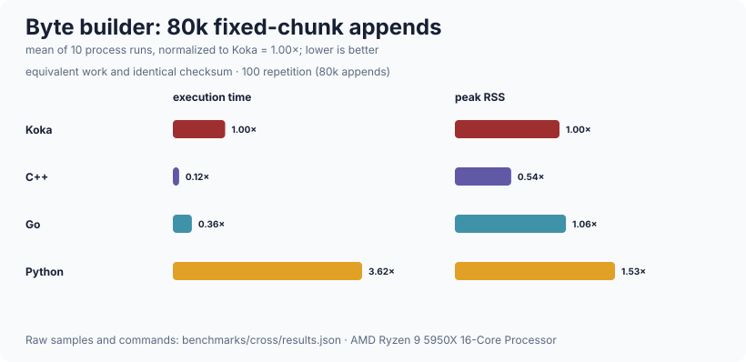
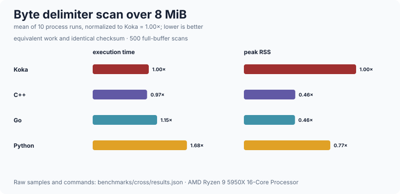

# bytes

Immutable sequences of octets, backed by the Koka runtime's own `kk_bytes_t`,
plus an append-only builder, fixed-width integer encoding, and an FNV-1a hash.
It exists because a socket and a file deal in octets, not in characters, and
because a byte sequence that is not valid UTF-8 must be something a program can
hold and reject rather than something that corrupts a decoder.  It is
deliberately *not* a general string library: there is no encoding beyond UTF-8,
no regular expressions, no formatting, no zero-copy views into other sequences,
and no mutable byte array.  `slice` copies on purpose, so a four-octet slice of
a megabyte buffer does not keep the megabyte alive.

## Public API

### Construction

| declaration | signature | what it is |
| --- | --- | --- |
| `bytes-empty` | `: bytes` | The empty sequence |
| `bytes` | `(s : string) : bytes` | UTF-8 encoding of `s`; always succeeds |
| `bytes` | `(xs : list<int>) : bytes` | From octet values; other values are taken modulo 256 |
| `replicate` | `(b : int, n : int) : bytes` | `n` copies of one octet |
| `concat` | `(xs : list<bytes>) : bytes` | Through the builder, so O(total) rather than O(total²) |

### Inspection

| declaration | signature | what it is |
| --- | --- | --- |
| `length` | `(b : bytes) : int` | Octets, not characters |
| `is-empty` / `is-notempty` | `(b : bytes) : bool` | |
| `at` | `(b : bytes, i : int) : maybe<int>` | The octet at `i` as 0..255, or `Nothing` out of range |
| `at-exn` | `(b : bytes, i : int) : exn int` | The same, throwing `ExnRange` instead |
| `list` | `(b : bytes) : list<int>` | Every octet |

### Combining and searching

| declaration | signature | what it is |
| --- | --- | --- |
| `(++)` / `cat` | `(a : bytes, b : bytes) : bytes` | Allocates and copies both operands |
| `slice` | `(b : bytes, start : int, count : int = -1) : bytes` | A copy of the range, clamped; asking for the whole sequence hands back the same value |
| `take` / `drop` | `(b : bytes, n : int) : bytes` | |
| `starts-with` | `(b : bytes, pre : bytes) : bool` | |
| `ends-with` / `contains` | `(b : bytes, other : bytes) : bool` | Suffix and subsequence tests |
| `strip-prefix` / `strip-suffix` | `(b : bytes, part : bytes) : maybe<bytes>` | The remainder when the part matches |
| `index-of` | `(b : bytes, sub : bytes, from : int = 0) : maybe<int>` | First occurrence at or after `from` |
| `split` | `(b : bytes, sep : int) : div list<bytes>` | On one octet; always one more element than there are separators |
| `split-on` | `(b : bytes, sep : bytes) : div list<bytes>` | On a byte sequence; an empty separator leaves `b` whole |

### Text

| declaration | signature | what it is |
| --- | --- | --- |
| `to-string` | `(b : bytes) : maybe<string>` | `Nothing` when the octets are not valid UTF-8 |
| `to-string-lossy` | `(b : bytes) : string` | Every invalid sequence becomes U+FFFD |
| `to-hex` | `(b : bytes) : string` | Lowercase, two characters per octet |
| `from-hex` | `(s : string) : maybe<bytes>` | Strict even-length hex; accepts either letter case |

### Equality, ordering, hashing

| declaration | signature | what it is |
| --- | --- | --- |
| `(==)` / `(!=)` | `(a : bytes, b : bytes) : bool` | |
| `compare` | `(a : bytes, b : bytes) : order` | |
| `hash` | `(b : bytes) : int` | FNV-1a.  Not a cryptographic hash and not offered as one |
| `show` | `(b : bytes) : string` | `bytes(n)[hex]` |

### Integer encoding

| declaration | signature | what it is |
| --- | --- | --- |
| `be16` / `be32` / `be64` / `le16` / `le32` / `le64` | `(v : int) : bytes` | Fixed width, explicit endianness |
| `read-be16` / `read-be32` / `read-be64` / `read-le16` / `read-le32` / `read-le64` | `(b : bytes, pos : int = 0) : maybe<int>` | Bounds checked; `Nothing` rather than reading past the end |

### The builder

| declaration | signature | what it is |
| --- | --- | --- |
| `builder-empty` | `(capacity : int = 64) : builder` | Room for `capacity` octets before the first growth |
| `reserve` | `(b : builder, n : int) : builder` | Room for `n` more without reallocating |
| `snoc-byte` | `(b : builder, x : int) : builder` | |
| `snoc` | `(b : builder, x : bytes) : builder` | |
| `snoc-string` | `(b : builder, s : string) : builder` | |
| `length` | `(b : builder) : int` | Qualify as `builder/length` where `:bytes` is also in scope |
| `finish` | `(b : builder) : bytes` | The accumulated octets; the builder is left empty and reusable |

### Low-level interoperation

| declaration | signature | what it is |
| --- | --- | --- |
| `unsafe-bytes-from-raw` | `(r : any) : bytes` | Wrap a boxed `kk_bytes_t` from a C binding |
| `unsafe-bytes-raw` | `(b : bytes) : any` | Unwrap one for a C binding.  Named for the care it needs |

## Complexity

| operation | cost |
| --- | --- |
| `length`, `at` | O(1) |
| `cat` / `(++)` | O(n + m), allocates and copies both |
| `slice`, `take`, `drop` | O(len), allocates and copies the selected range |
| `(==)` | O(n), exits early on differing lengths |
| `compare` | O(n), no early exit |
| `hash`, `to-hex`, `to-string` | O(n) |
| `index-of`, `contains`, `split-on` | O(n·m) worst case; a naive scan that skips with `memchr`, no Boyer-Moore |
| builder `snoc*` | amortized O(1), so building a sequence of n octets is O(n) |
| `concat`, `bytes(list)` | O(total), through the builder |
| building by repeated `++` | **O(n²)** — use the builder |

Measured on this machine (AMD Ryzen 9 5950X, 32 threads, 126 GiB, Linux 7.0.1
x86_64, Koka 3.2.7, `--release`, fastest of 3):

| what | n | ms | units/s |
| --- | ---: | ---: | ---: |
| builder `snoc` of a 10-octet chunk | 2 000 000 | 26 | 76 923 076 |
| builder `snoc` of a 10-octet chunk | 8 000 000 | 103 | 77 669 902 |
| repeated `++` of a 10-octet chunk | 20 000 | 28 | 714 285 |
| repeated `++` of a 10-octet chunk | 80 000 | 545 | 146 788 |
| `slice` 4 KiB out of a 1 MiB sequence | 200 000 | 14 | 14 285 714 |
| `slice` 4 KiB out of a 1 MiB sequence | 800 000 | 55 | 14 545 454 |
| `at`, every octet of 1 MiB (n = MiB) | 8 | 64 | 125 |
| `at`, every octet of 1 MiB (n = MiB) | 32 | 255 | 125 |
| `hash` 1 MiB, FNV-1a (n = MiB) | 64 | 55 | 1 163 |
| `hash` 1 MiB, FNV-1a (n = MiB) | 256 | 219 | 1 168 |
| `index-of`, no match, 1 MiB (n = MiB) | 256 | 2 | 128 000 |
| `index-of`, no match, 1 MiB (n = MiB) | 1 024 | 9 | 113 777 |
| `index-of`, worst case, 1 MiB (n = MiB) | 8 | 23 | 347 |
| `index-of`, worst case, 1 MiB (n = MiB) | 32 | 93 | 344 |

The first two pairs are the point.  Four times the work costs the builder 4.0x
and repeated `++` 19x: O(n) against O(n²), on identical input.  `slice`, `at`
and `hash` are flat per unit, which is what O(len) and O(n) look like, and
`hash` runs at about 1.1 GiB/s.

`at` reads about 125 MiB/s, which is 8 ns an octet for a one-octet read: nearly
all of it is the call into C and the `:maybe` it allocates.  That is why a scan
should ask for each octet once and why `at` bounds checks inside the primitive
rather than asking for the length first — the second call used to cost 2 ns an
octet on its own.

The two `index-of` pairs are the same scan on the two kinds of input it has.
Octets that cannot begin a match are skipped with `memchr`, so a needle whose
first octet is absent from the haystack — the ordinary case, and the one every
`\r\n` search in `http` is — runs at the rate `memchr` reads memory.  The 1 MiB
haystack sits in cache, so 100 GiB/s is a cache figure and not what a scan over
main memory achieves.

The worst case is a needle whose first *and* last octet match at every position:
neither the skip nor the last-octet check rejects anything, so every position
pays a `memcmp`, at about 345 MiB/s.  That is roughly 13% slower than the scan
without the skip, which is the price of the ordinary case being two orders of
magnitude faster.  The complexity is unchanged; only the constant is.

Reproduce with `./run-benchmarks.sh bytes` from the repository root.

### Across languages





The suite exercises both byte construction and delimiter search using the same
work and checksum in every language. See the
[ten-run time/RSS methodology](../benchmarks/cross/README.md).

## Worked example

```koka
import bytes/bytes

fun main()
  // Build a small binary frame: a 2-octet big-endian length, then a payload.
  val payload = bytes("hello")
  val frame   = builder-empty(16)
                  .snoc(be16(payload.length))
                  .snoc(payload)
                  .finish
  println(frame.to-hex)                       // 000568656c6c6f

  // Read it back.
  match frame.read-be16(0)
    Nothing -> println("truncated frame")
    Just(n) ->
      match frame.slice(2, n).to-string
        Just(text) -> println("payload: " ++ text)
        Nothing    -> println("payload is not valid UTF-8")
```

## Limits

* **`slice` is a copy, not a view.**  That is the design, not an oversight: a
  view would keep the whole source alive, which is how a parser holding one
  header field pins a megabyte request buffer.  It also means slicing in a loop
  is O(total), not free.
* **`index-of` is a naive scan**, so a pathological needle and haystack cost
  O(n·m).  Skipping with `memchr` and rejecting a candidate on its last octet
  change the constant, not that; a needle whose first and last octets are both
  common in the haystack still costs a comparison per position.  Nothing in
  this tree searches for attacker-controlled needles in attacker-controlled
  haystacks, and this would need revisiting if something did.
* **`from-hex` is deliberately strict.**  It accepts upper- and lower-case
  hexadecimal digits, but not a `0x` prefix, whitespace, separators, or an odd
  number of digits.  This makes malformed wire and storage values visible
  instead of silently normalizing them.
* **`split-on` treats an empty separator as no split.**  It returns `[b]`;
  callers that want every boundary must state that operation explicitly
  instead of accidentally requesting a non-terminating scan.
* **`hash` is FNV-1a.**  It is not collision resistant and must not be used
  where an adversary picks the keys and the cost of collisions matters.  It is
  here so `:bytes` can be a `hashmap` key.
* **An allocation failure aborts the process** with a message on stderr, rather
  than throwing or truncating.  This holds for every allocation the package
  makes — the builder's buffer, and the working buffers of `to-string-lossy`
  and `to-hex` — so none of them can hand back a short result that looks
  complete.  A short response that looks complete is worse than a crash, and an
  exception would put `exn` in the row of every `snoc` and therefore of every
  caller of the JSON generator and the HTTP response writer.
* **A builder is linear by convention, not by type.**  Each operation returns
  the builder and the previous value must not be used again; using a stale one
  appends to the same buffer and is not detected.
* **`unsafe-bytes-from-raw` and `unsafe-bytes-raw` are unchecked.**  They are
  safe exactly when the `any` really is a boxed `kk_bytes_t`.
* **Size is bounded by `kk_ssize_t`**, so in practice by available memory.
