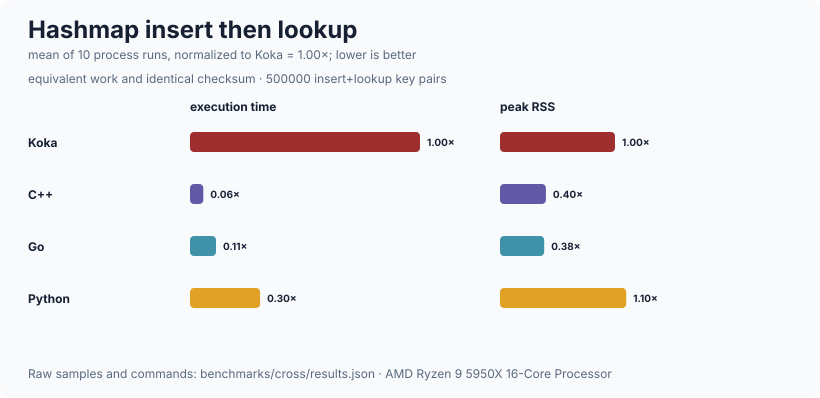

# hashmap

A persistent hash map and hash set: a weight-balanced binary search tree
ordered by the *hash* of the key, with a bucket at each node holding every
entry whose key hashes to that value.  Ordering by the hash rather than by the
key means a key type only has to supply `hash` and `(==)`, not a total order,
and using a tree rather than an array of buckets avoids bitwise arithmetic on
Koka's arbitrary-precision `:int`.  It is persistent, so an update shares
everything it did not touch and an old version stays valid.  It is deliberately
*not* a fast mutable hash table: there is no in-place update, no open
addressing, no resizing, no ordered iteration by key, and no attempt to be
competitive with an imperative table.  The reference service needs a map it can
share across a request without copying, and this is that.

## Public API

### `hashmap/map` — the map

| declaration | signature | what it is |
| --- | --- | --- |
| `hmap<k,v>` | `type { Tip; Bin(size, nodes, hash, bucket, left, right) }` | The map.  `size` counts entries, so `size` is O(1); `nodes` counts `Bin`s and is the weight the balancer uses.  See [the two counts](#the-two-counts) |
| `empty` | `() : hmap<k,v>` | |
| `is-empty` | `(m : hmap<k,v>) : bool` | |
| `size` | `(m : hmap<k,v>) : int` | |
| `lookup` | `(m, key : k, ?hash, ?(==)) : div maybe<v>` | |
| `contains` | `(m, key : k, ?hash, ?(==)) : div bool` | |
| `get` | `(m, key : k, default : v, ?hash, ?(==)) : div v` | |
| `insert` | `(m, key : k, value : v, ?hash, ?(==)) : div hmap<k,v>` | Replaces any existing entry |
| `insert-with` | `(m, key, value, combine : (v, v) -> v, ?hash, ?(==)) : div hmap<k,v>` | `combine(old, new)` when the key is present |
| `update` | `(m, key, f : (v) -> v, ?hash, ?(==)) : div hmap<k,v>` | Applies `f` only if the key is there |
| `alter` | `(m, key, f : maybe<v> -> maybe<v>, ?hash, ?(==)) : div hmap<k,v>` | Insert, replace, or remove in one API |
| `remove` | `(m, key, ?hash, ?(==)) : div hmap<k,v>` | |
| `pop` | `(m, key, ?hash, ?(==)) : div maybe<(v,hmap<k,v>)>` | Removed value and remaining map |
| `list` | `(m) : div list<(k,v)>` | All entries in iteration order |
| `keys` / `values` | `(m) : div list<k>` / `div list<v>` | |
| `hmap` | `(xs : list<(k,v)>, ?hash, ?(==)) : div hmap<k,v>` | From an association list; later entries win |
| `foreach` | `(m, action : (k, v) -> <div\|e> ()) : <div\|e> ()` | |
| `fold` | `(m, init, f : (a,k,v) -> <div\|e> a) : <div\|e> a` | Iteration-order fold without an intermediate list |
| `map` | `(m, f : (v) -> v2) : div hmap<k,v2>` | Values only; the tree shape is preserved |
| `map-with-key` | `(m, f : (k,v) -> v2) : div hmap<k,v2>` | Value transform with its key |
| `filter` | `(m, pred : (k, v) -> bool, ?hash, ?(==)) : div hmap<k,v>` | Rebuilds |
| `filter-map` | `(m, f : (k,v) -> maybe<v2>, ?hash, ?(==)) : div hmap<k,v2>` | Transform and filter together |
| `union` / `union-with` | `(a, b, combine?, ?hash, ?(==)) : div hmap<k,v>` | `union` is left-biased |
| `intersect` / `intersection-with` | `(a, b, combine?, ?hash, ?(==)) : div hmap` | Keep common keys; optionally combine values of different types |
| `difference` | `(a, b, ?hash, ?(==)) : div hmap<k,v>` | Remove keys present in `b` |
| `(==)` | `(m1, m2, ?hash, ?key/(==), ?val/(==)) : div bool` | Same entries, regardless of tree shape or bucket order |
| `show` | `(m, ?kshow, ?vshow) : div string` | |
| `is-balanced` / `is-ordered` | `(m) : div bool` | The tree invariants, exposed so tests can check them after every operation rather than only checking observable behaviour |

### `hashmap/set` — the set

A distinct type over `hmap<k,()>` rather than an alias, because an alias would
make every set operation overload-ambiguous with the map operation of the same
name.

| declaration | signature | what it is |
| --- | --- | --- |
| `hset<k>` | `value struct { entries : hmap<k,()> }` | |
| `empty` | `() : hset<k>` | |
| `is-empty` / `is-notempty` / `size` | `(s : hset<k>) : bool` / `int` | |
| `singleton` | `(key : k, ?hash, ?(==)) : div hset<k>` | |
| `insert` / `remove` | `(s, key : k, ?hash, ?(==)) : div hset<k>` | |
| `member` / `contains` | `(s, key : k, ?hash, ?(==)) : div bool` | |
| `list` | `(s) : div list<k>` | |
| `hset` | `(xs : list<k>, ?hash, ?(==)) : div hset<k>` | |
| `union` / `intersect` / `difference` / `symmetric-difference` | `(a, b, ?hash, ?(==)) : div hset<k>` | |
| `subset` / `proper-subset` / `superset` / `disjoint` | `(a, b, ?hash, ?(==)) : div bool` | |
| `foreach` / `fold` | `(s, action, ...)` | Iteration-order traversal |
| `filter` / `map` | `(s, f, ?hash, ?(==)) : div hset` | `map` rebuilds and deduplicates transformed keys |
| `(==)` | `(a, b, ?hash, ?(==)) : div bool` | |
| `show` | `(s, ?show) : div string` | |

### The two counts

A node stores both the number of entries beneath it and the number of nodes.
They coincide only while every bucket holds exactly one entry, which is to say
only while no two keys collide — and the whole point of the bucket is that they
sometimes do.

Only the node count may be used for balancing.  A rotation moves nodes; an
entry can only leave a bucket by being removed.  So a balance invariant stated
on the entry count is one no rotation can restore: insert one key hashing to 1
and two keys hashing to 0, and the tree is a root with a two-entry child and no
right sibling, which `rotate-right` looks at and leaves exactly as it found it.
`is-balanced` reported `False` there, permanently, and every test that could
have caught it ran under `int/hash(i) = i`, where the two counts are equal.
`map-test.kk` now checks the invariant under a colliding hash as well.

The second count costs one word per node — 48 bytes to 56 — which is visible
in the lookup rows of the table below.

### What a key type must supply

`?hash : k -> int` and `?(==) : (k,k) -> bool`, with the usual requirement:

> if `a == b` then `hash(a) == hash(b)`

A hash need not be non-negative and need not be well distributed for the map to
be *correct*.  Poor distribution only degrades a lookup within one bucket to a
linear scan of that bucket.

## Complexity

| operation | cost |
| --- | --- |
| `lookup`, `contains`, `get` | O(log n) + O(bucket) |
| `insert`, `insert-with`, `remove` | O(log n) + O(bucket), rebuilding O(log n) nodes |
| `update` | O(log n) for the lookup plus O(log n) for the insert |
| `size`, `is-empty` | O(1) |
| `list`, `keys`, `values`, `foreach`, `fold`, `map`, `map-with-key` | O(n) |
| `filter`, `filter-map`, `hmap` | O(n log n) — every surviving entry is reinserted |
| map `union`, `union-with`, `difference` | O(m log(n+m)) |
| map `intersect`, `intersection-with` | O(n log m) |
| `(==)` | O(n log n) |
| `union`, `difference` (sets) | O(m log(n+m)) |
| `intersect`, `subset` (sets) | O(m log n) |

Measured on this machine (AMD Ryzen 9 5950X, 32 threads, 126 GiB, Linux 7.0.1
x86_64, Koka 3.2.7, `--release`, fastest of 3).  Every row does the same
524 288 operations, split into as many repetitions of the stated map size as it
takes, so `units/s` is directly comparable down the column:

| what | n | ms | units/s |
| --- | ---: | ---: | ---: |
| insert (map of 1k) | 524 288 | 158 | 3 318 278 |
| insert (map of 4k) | 524 288 | 200 | 2 621 440 |
| insert (map of 16k) | 524 288 | 242 | 2 166 479 |
| lookup (map of 1k) | 524 288 | 56 | 9 362 285 |
| lookup (map of 4k) | 524 288 | 63 | 8 322 031 |
| lookup (map of 16k) | 524 288 | 71 | 7 384 338 |
| remove (map of 1k) | 524 288 | 132 | 3 971 878 |
| remove (map of 16k) | 524 288 | 187 | 2 803 679 |
| set `union`, 8k into 8k (n = inserts) | 256 000 | 131 | 1 954 198 |
| set `intersect`, 8k and 8k | 256 000 | 106 | 2 415 094 |

Sixteen times as many entries costs 1.5x per insert and 1.3x per lookup.  A
flat column would have meant the tree was not being walked at all; a 16x column
would have meant it was a list.

A node carries a node count as well as an entry count, so it is 56 bytes rather
than 48 — about a word per node of cache, spent on a balance invariant that a
rotation can actually restore.

Reproduce with `./run-benchmarks.sh hashmap` from the repository root.

### Across languages



Each implementation inserts the same integer keys and values, looks them all
up, and prints the same checksum. See the
[ten-run time/RSS methodology](../benchmarks/cross/README.md).

## Worked example

```koka
import hashmap/map
import hashmap/set

// The map resolves `?hash` implicitly by name, which is why this is called
// `int/hash` rather than something descriptive.
pub fun int/hash( i : int ) : int
  (i * 2654435761) % 1000003

fun main()
  val counts = hmap([("apples", 3), ("pears", 1)], ?hash = fn(s : string) s.count)
  match counts.lookup("apples", ?hash = fn(s : string) s.count)
    Just(n) -> println("apples: " ++ n.show)
    Nothing -> println("no apples")

  // With a `hash` in scope for the key type, no explicit argument is needed.
  val m = hmap([(1, "one"), (2, "two"), (3, "three")])
  println(m.size.show ++ " entries")
  match m.lookup(2)
    Just(name) -> println("2 is " ++ name)
    Nothing    -> println("2 is missing")

  // Persistence: `m` is unchanged by the insert.
  val m2 = m.insert(4, "four")
  println(m.size.show ++ " then " ++ m2.size.show)     // 3 then 4

  val evens = hset([2, 4, 6])
  val small = hset([1, 2, 3, 4])
  println(evens.intersect(small).size.show)            // 2
```

## Limits

* **Iteration order is ascending hash value**, and within one bucket
  least-recently-inserted first.  That is deterministic for a given sequence of
  operations and a given `hash`, but it is **not** insertion order and **not**
  key order, and it changes if the `hash` function changes.  Do not rely on it
  for output a user sees — sort explicitly.
* **No in-place reuse, even for a uniquely referenced map.**  Koka's reuse
  analysis is intra-procedural: `insert-go` matches the `Bin` and acquires a
  reuse token, but the node is rebuilt inside `balance`, and the token is
  dropped at the call boundary — visible as `kk_reuse_drop` in the generated
  `hashmap_map.c`.  Every insert therefore allocates a fresh path of O(log n)
  nodes.  Inlining the rebuild into `insert-go` would let the token through;
  until that is done *and re-checked against the generated C*, this is a known
  cost and not a guarantee.
* **A bad hash degrades to a linear scan of one bucket.**  Correctness is
  unaffected; a key type whose `hash` returns a constant turns every operation
  into O(n).
* **Every operation carries `div`.**  The tree walks are recursive and the
  termination checker cannot bound them, so `div` appears in the row of every
  caller.
* **`filter` and `hmap` rebuild from scratch**, which is O(n log n) rather than
  the O(n) a structural rebuild could manage.  `filter-map` and the map/set
  combining operations similarly favor simple persistent composition over a
  specialized linear tree merge.
* **Map algebra is defined by keys, not iteration order.**  `union` is
  left-biased; `union-with` calls `combine(left, right)`.  `intersect` retains
  the left value, while `intersection-with` makes both sides explicit.
* **`map` changes only the values.**  Changing keys would change hashes and
  therefore the tree, so it would have to rebuild; that is `hmap(m.list.map(..))`
  and is left explicit.
