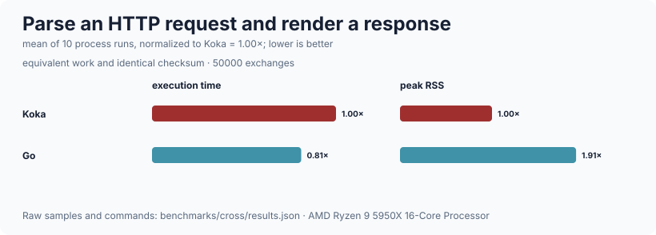

# http

HTTP/1.1 message parsing, a minimal router, and a connection server on
`runtime`'s task groups.  Parsing works on `:bytes` and is incremental: `parse`
is handed whatever the socket produced and reports whether a complete request
has arrived, so the server never has to guess how much to read.  Framing is
where HTTP servers get taken apart, so the parser is strict rather than
forgiving — a bare CR or LF in the head is a 400, `Content-Length` must be
digits and nothing else, and `Transfer-Encoding` is a 501 rather than something
half-handled.  It is deliberately *not* a web framework: there is no middleware
stack, no route groups, no wildcards or regular expressions, no chunked bodies,
no compression, no multipart, no cookies or sessions, no static file serving,
no TLS, no HTTP/2, and nothing proxy-shaped.

## Public API

### `http/message` — requests, responses, parsing

| declaration | signature | what it is |
| --- | --- | --- |
| `request` | `struct { method; path; query; version; headers; body : bytes }` | `path` has the query string removed; header names are lower-cased on the way in |
| `header` | `(r : request, name : string) : maybe<string>` | Case-insensitive, without a second pass |
| `content-length` | `(r : request) : maybe<int>` | `Nothing` when the header is absent *or* not a strict non-negative decimal — the two cases a plain `int` could not tell apart from a real 0 |
| `wants-keep-alive` | `(r : request) : bool` | HTTP/1.1 defaults to yes, HTTP/1.0 to no |
| `response` | `struct { status; reason; headers; body : bytes }` | |
| `response` | `(status : int, body : bytes = bytes-empty, headers = [], reason : string = "") : response` | An empty `reason` picks the default |
| `text-response` | `(status : int, text : string, content-type : string = "text/plain; charset=utf-8") : response` | |
| `json-response` | `(status : int, json-text : string) : response` | |
| `default-reason` | `(status : int) : string` | The sixteen statuses this tree emits, `"Unknown"` otherwise |
| `render` | `(r : response, keep-alive : bool) : div bytes` | Serialise.  `Content-Length` is always emitted and `Connection` reflects what the *server* decided |
| `parse` | `(buffer : bytes, lim : limits = default-limits, from : int = 0) : div parse-result` | `from` is a promise that no terminator begins before that offset |
| `parse-result` | `type { Incomplete; Parsed(request, rest : bytes); Failed(error) }` | `rest` is whatever followed — the start of the next request, on a keep-alive connection |
| `parse-error` | `struct { status : int; message : string }` | Carries the status to answer with, so the server does not map errors to codes itself |
| `limits` | `struct { max-request-line; max-header-bytes; max-headers; max-body }` | |
| `default-limits` | `: limits` | 8 KiB, 16 KiB, 100 headers, 1 MiB |
| `strict-nat` | `(s : string) : maybe<int>` | One or more ASCII digits and nothing else |
| `is-token` | `(s : string) : bool` | RFC 9110 `token` |
| `has-control` | `(s : string) : bool` | Any control character other than HTAB, plus DEL |

### `http/router` — method, literal path, `:name` parameters

| declaration | signature | what it is |
| --- | --- | --- |
| `params` | `alias = list<(string, string)>` | Captured parameters, in declaration order |
| `param` | `(ps : params, name : string) : maybe<string>` | |
| `route` | `(method : string, pattern : string, run : (request, params) -> e response) : route<e>` | e.g. `route("GET", "/items/:id", handler)` |
| `route<e>` | `struct { method; pattern; run }` | |
| `match-result<e>` | `type { Matched(run, params); NoSuchPath; WrongMethod(allowed) }` | |
| `route-match` | `(routes : list<route<e>>, verb : string, path : string) : match-result<e>` | First declared wins |
| `match-pattern` | `(pattern : string, path : string) : maybe<params>` | Segments compare literally except `:name`; an empty capture does not match, so `/items/` does not satisfy `/items/:id` |
| `dispatch` | `(routes, r : request, not-found = default-not-found, wrong-method = default-wrong-method) : e response` | Produces the 404 and 405 itself |
| `default-not-found` / `default-wrong-method` | | JSON bodies; the 405 carries an `Allow` header |

A path that matches no route is 404; a path that matches a route's *pattern*
but not its method is 405 with an `Allow` header listing the methods that would
have worked — which is why the router, not the handler, decides that.

### `http/server` — one task per connection

| declaration | signature | what it is |
| --- | --- | --- |
| `config` | `struct { host; port; max-connections; request-timeout-ms; idle-timeout-ms; max-requests; max-reads; read-chunk; limits; backlog }` | |
| `default-config` | `: config` | 127.0.0.1:8080, 256 connections, 15 s / 30 s timeouts, 100 requests and 1024 reads per connection, 64 KiB reads, backlog 128 |
| `validate-config` | `(cfg : config) : maybe<string>` | `Nothing` when the serving-loop invariants hold; otherwise a specific startup error |
| `log-config` | `struct { emit; min : level; base : list<field> }` | Passed as values, because the logger handler is installed per connection |
| `default-log-config` | `: log-config` | Writes to **stdout** at `Info` |
| `server` | `struct { group; bound; stopping }` | |
| `port` | `(s : server) : int` | Which port was bound, for a `port = 0` configuration |
| `stop` | `(s : server) : io ()` | Stop accepting and cancel in-flight work |
| `serve` | `(serve-request : (request) -> <async,logger\|io> response, ready : (server) -> <async\|io> (), cfg = default-config, logs = default-log-config) : io ()` | `ready` is called once with the running server; when it returns, the server shuts down |
| `serve-routes` | `(routes : list<route<<async,logger\|io>>>, ready, cfg, logs) : io ()` | `serve` over a route table |

## What is bounded

Everything.  A connection that misbehaves costs a bounded amount:

* the accept loop stops at `max-connections` concurrent connections;
* a read is at most `read-chunk` octets;
* the buffered request may not exceed the message limits, checked *while*
  reading rather than after;
* a request has `request-timeout-ms` to arrive in full;
* an idle keep-alive connection is closed after `idle-timeout-ms`;
* a connection serves at most `max-requests` requests;
* one request may be assembled from at most `max-reads` socket reads, which
  bounds the repeated buffer join.

| limit | default | why |
| --- | --- | --- |
| `max-request-line` | 8 KiB | a URL longer than this is not a mistake |
| `max-header-bytes` | 16 KiB | bounds the header block alone |
| `max-headers` | 100 | bounds per-header work |
| `max-body` | 1 MiB | bounds one request body |

`serve` validates these values and the serving-loop controls before binding.
Zero or negative connection/read limits therefore fail at startup instead of
turning into a server that spins, sleeps forever, or rejects every first read.

Framing rules, all of them deliberate: line endings must be CRLF, because an
intermediary that accepts one where we accept the other is how requests get
smuggled past a front end; `Content-Length` must be one or more ASCII digits
and nothing else (no sign, no `0x`, no separators), and repeating the header
with conflicting values is a 400; `Transfer-Encoding` together with
`Content-Length` is a 400 and on its own is a 501; obsolete line folding is a
400.  A handler cannot supply its own `content-length`, `transfer-encoding` or
`connection` — those are dropped from the rendered response, not emitted
alongside the server's.

## Complexity

| operation | cost |
| --- | --- |
| `parse` over an n-octet buffer | O(n) to find the terminator, then O(head) to split it |
| `parse` across `k` incremental reads with `from` | **O(total)** overall.  Without `from`, O(total²) |
| `render` with `h` headers | O(response size), through `strbuilder` |
| `header` on a request with `h` headers | O(h) — an association list |
| `route-match` over `r` routes with `s` path segments | O(r·s) — a linear scan, first declared wins |
| `has-bare-eol`, `is-token`, `has-control` | O(length), one pass |
| accept loop | O(1) per connection, capped at `max-connections` live |

Measured on this machine (AMD Ryzen 9 5950X, 32 threads, 126 GiB, Linux 7.0.1
x86_64, Koka 3.2.7, `--release`, fastest of 3):

| what | n | ms | units/s |
| --- | ---: | ---: | ---: |
| parse a request, 3 headers | 200 000 | 537 | 372 439 |
| parse a request, 31 headers | 100 000 | 1 888 | 52 966 |
| render a 200 with 2 headers | 200 000 | 170 | 1 176 470 |
| dribbled 1 octet/read, with `from` (n = parse calls) | 145 400 | 16 | 9 087 500 |
| dribbled 1 octet/read, rescan from 0 (n = parse calls) | 145 400 | 24 | 6 058 333 |
| `route-match`, 5 routes, last matches | 500 000 | 719 | 695 410 |
| `route-match`, 5 routes, no match | 500 000 | 430 | 1 162 790 |

A small request parses in about 2.7 µs and a response renders in about 0.9 µs.
Ten times as many headers costs 7.0x, which is the linear header scan plus the
larger buffer.

The dribbled pair is the row worth having.  Both feed the same 727-octet
request one octet at a time, so both make the same number of `parse` calls;
they differ only in whether the caller passes the `from` offset the server
passes.  Rescanning from zero is **1.5 times slower** on a request this size,
and the gap grows with the request, because it is O(total²) against O(total).
That is what the `from` parameter is for, and why `http/server` maintains it.
The margin is this narrow only because `bytes/index-of` skips with `memchr`;
the quadratic term is still there, and it is the request size that decides
whether it matters.

Reproduce with `./run-benchmarks.sh http` from the repository root.

### Across languages



Each implementation parses the same request and renders the same response,
checking the same fields and output length. See the
[ten-run time/RSS methodology](../benchmarks/cross/README.md).

## Worked example

```koka
import bytes/bytes
import http/message
import http/router

fun show-one( _r : request, ps : params ) : io response
  val id = match ps.param("id")
             Just(v) -> v
             Nothing -> "?"
  text-response(200, "item " ++ id)

val item-routes : list<route<io>> =
  [ route("GET",  "/items",     fn(_r, _p) text-response(200, "all"))
  , route("GET",  "/items/:id", show-one)
  , route("POST", "/items",     fn(_r, _p) text-response(201, "made")) ]

fun main()
  // Parsing is incremental: a partial buffer is `Incomplete`, not an error.
  val partial = bytes("GET /items/42 HTTP/1.1\r\nhost: example.test\r\n")
  match parse(partial)
    Incomplete   -> println("incomplete, as expected")
    Parsed(_, _) -> println("unexpectedly complete")
    Failed(e)    -> println("unexpected failure: " ++ e.message)

  val whole = bytes("GET /items/42?limit=10 HTTP/1.1\r\nhost: example.test\r\n\r\n")
  match parse(whole)
    Incomplete -> println("unexpectedly incomplete")
    Failed(e)  -> println("unexpected failure: " ++ e.message)
    Parsed(req, _rest) ->
      println(req.method ++ " " ++ req.path ++ " ? " ++ req.query)
      match req.header("Host")            // lookup is case insensitive
        Just(h) -> println("host: " ++ h)
        Nothing -> println("no host header")
      println("keep-alive: " ++ req.wants-keep-alive.show)

      // Routing, and the response the router produces itself.
      val resp = dispatch(item-routes, req)
      println(resp.render(True).to-string-lossy)

  // Ambiguous framing is refused rather than resolved.
  val smuggle = bytes("POST /x HTTP/1.1\r\nhost: h\r\n" ++
                      "content-length: 3\r\ncontent-length: 4\r\n\r\nabc")
  match parse(smuggle)
    Failed(e)    -> println(e.status.show ++ " " ++ e.message)   // 400 conflicting ...
    Parsed(_, _) -> println("unexpectedly accepted two lengths")
    Incomplete   -> println("unexpectedly incomplete")
```

Serving is `serve-routes(routes, ready)`, where `ready` is called once with the
running server and the server shuts down when it returns.  See
`koka-examples/notes-service` for a complete one.

## Tests

The package integration suite binds ephemeral loopback ports and covers split
reads, pipelining, malformed-request containment, handler failure containment,
per-connection request limits, configuration rejection, and orderly shutdown.

## Limits

* **No chunked request bodies.**  `Transfer-Encoding` is answered with 501, not
  half-handled.  Responses are always `Content-Length` framed and never
  chunked, so a handler cannot stream a response of unknown length.
* **The whole body is buffered before the handler runs**, bounded by
  `max-body`.  There is no streaming request body.
* **The response body is a `:bytes` in memory.**  No `sendfile`, no streaming
  writer.
* **The router is a linear scan with literal segments and `:name` captures.**
  No wildcards, no regular expressions, no optional segments, no trailing-slash
  normalisation.  Five routes is what it was built for.
* **`param` and `header` are association-list scans**, which is fine at the
  sizes the limits allow and would not be at larger ones.
* **No cookies, sessions, authentication, CORS, compression, static files, or
  TLS.**  A service that needs any of them supplies it in a handler.
* **`content-length` is `maybe<int>`, not `int`.**  It used to return 0 for a
  header that was absent, one that was literally `0`, and one that was
  unparseable — three different facts as one number — while `body-length`, the
  private sibling that actually decides framing, rejected the unparseable ones
  with a 400.  A public accessor more forgiving than the framing rule is how
  the two come to disagree about how many octets follow, which is what request
  smuggling is.  A `:request` that `parse` produced can still only carry a
  value the framing rule accepted.
* **Nothing yields to the event loop while parsing.**  A 1 MiB body is parsed
  in one go, which at the measured rate is a few milliseconds during which the
  single-threaded loop serves nobody.
* **`max-reads` is a blunt instrument.**  A slow but honest client that sends a
  large body in many small pieces is answered with a 408 once it exceeds
  `max-reads`, the same as a deliberate dribbler.
