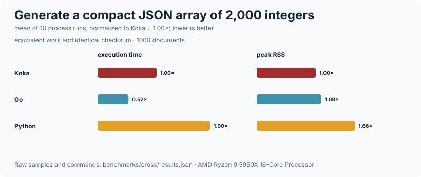
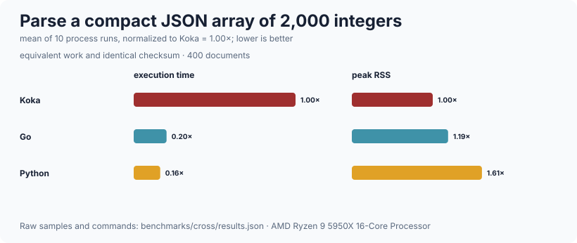

# json

A JSON value type, a parser with explicit limits and source positions, and a
builder-based generator.  It parses `:bytes` rather than `:string` because that
is what arrives from a socket, and because a document that is not valid UTF-8
has to be rejected as malformed input rather than crash a decoder.  Every limit
is a parameter and is enforced *while* parsing, so a hostile document is
refused before it costs anything, and every failure carries a byte offset, a
line and a column.  It is deliberately *not* a serialisation framework: there
is no derivation of encoders and decoders from types, no schema validation, no
JSONPath, no streaming or incremental parse, no pretty printing, and no
floating-point numbers.  RFC 6901 JSON Pointer lookup and construction are
provided separately in `json/pointer`.

## Public API

### `json/value` — the value type

| declaration | signature | what it is |
| --- | --- | --- |
| `json` | `type { JsNull; JsBool(value); JsInt(value); JsString(value); JsArray(items); JsObject(members) }` | Objects keep their members in source order, in an association list |
| `member` | `(j : json, name : string) : maybe<json>` | Linear lookup in an object; `Nothing` for anything else |
| `as-string` / `as-int` / `as-bool` | `(j : json) : maybe<string>` / `maybe<int>` / `maybe<bool>` | |
| `as-array` | `(j : json) : maybe<list<json>>` | |
| `as-object` | `(j : json) : maybe<list<(string, json)>>` | |
| `is-null` | `(j : json) : bool` | |
| `type-name` | `(j : json) : string` | `"an array"`, `"a number"`, … for error messages |
| `write` | `(b : strbuilder, j : json) : div strbuilder` | Append to an existing builder |
| `show` | `(j : json) : div string` | Render to a string |
| `obj` / `arr` / `str` / `num` / `boolean` | constructors | Shorthands for building a value |

Every accessor returns `:maybe` rather than throwing, so a decoder can collect
all of a document's problems and report them in its own terms.

### `json/pointer` — RFC 6901 paths

| declaration | signature | what it is |
| --- | --- | --- |
| `pointer` | `(root : json, path : string) : maybe<json>` | Look up a string-form JSON Pointer.  `""` names the root; malformed syntax, missing members and out-of-range indexes return `Nothing` |
| `pointer-token` | `(token : string) : string` | Escape `~` and `/` in one reference token |
| `pointer-path` | `(tokens : list<string>) : string` | Build a pointer from unescaped tokens; `[]` produces `""` |

Array indexes are canonical non-negative decimals: `0` is accepted, while
`00`, signs, `-`, overflow and non-digits are rejected.  This module implements
the JSON string representation (`/items/0`), not the URI fragment
representation (`#/items/0`); percent-decoding belongs at the URI layer.

### `json/parse` — the parser

| declaration | signature | what it is |
| --- | --- | --- |
| `parse` | `(input : bytes, lim : limits = default-limits) : div either<json-error, json>` | A complete document.  Trailing content other than whitespace is an error, so a body cannot smuggle a second document |
| `parse-string` | `(input : string, lim : limits = default-limits) : div either<json-error, json>` | |
| `limits` | `struct { max-bytes; max-depth; max-members; max-string; duplicates }` | |
| `default-limits` | `: limits` | 1 MiB, depth 64, 10 000 members, 65 536-character strings, `DuplicateReject` |
| `duplicate-policy` | `type { DuplicateReject; DuplicateFirst; DuplicateLast }` | |
| `json-error` | `struct { message; offset; line; column }` | |
| `show` | `(e : json-error) : string` | `"… at line L, column C (byte N)"` |
| `and-then` | `(r : either<e,a>, next : (a) -> <div\|f> either<e,b>) : <div\|f> either<e,b>` | Chain fallible steps.  Written so it composes with `with`: `with x <- p.and-then` reads as "let `x` be what `p` produced, and if `p` failed, return that failure" |

### Limits, and why each one is there

| limit | default | why |
| --- | --- | --- |
| `max-bytes` | 1 MiB | bounds the work one document can cause |
| `max-depth` | 64 | bounds recursion, so nesting cannot exhaust the stack |
| `max-members` | 10 000 | bounds one object or array |
| `max-string` | 65 536 | bounds one string, counted in *characters* |

`max-depth` is 0-based, so `max-depth = 5` permits five levels of nesting.

### Deliberate strictness

* **Only integers.**  A fractional or exponent form is an error naming the
  token, not a rounded value: a service that silently truncates a price is
  worse than one that rejects it.
* **No leading zeros.**  RFC 8259 forbids them.  Accepting `01` where a
  validator, a gateway or a signature check rejects it is a parser
  differential, and a parser differential in front of a database write is how
  requests get through checks meant to stop them.
* **Duplicate keys are rejected by default**, because silently picking one is a
  security-relevant surprise.  `DuplicateFirst` and `DuplicateLast` are
  available and have to be asked for.
* **UTF-8 is validated up front.**  Inside strings, `\uXXXX` escapes are
  decoded including surrogate pairs; an unpaired surrogate is an error.

## Complexity

| operation | cost |
| --- | --- |
| `parse` over an n-octet document | O(n) — including objects, thanks to the `hset` of seen keys |
| duplicate-key detection | O(1) per member, amortized, via a hash set |
| `DuplicateLast` | O(members) for the member it replaces, so O(n·d) for `d` duplicates |
| `member` on an object of `k` members | O(k) — an association list, not a map |
| `pointer` over `t` tokens | O(t + visited object members + visited array indexes) |
| `show` / `write` over a value of n characters | O(n), through `strbuilder` |
| `line-col` when reporting an error | O(offset), and only on the failure path |
| UTF-8 validation | O(n), once, before parsing |

Measured on this machine (AMD Ryzen 9 5950X, 32 threads, 126 GiB, Linux 7.0.1
x86_64, Koka 3.2.7, `--release`, fastest of 3).  `n` is KiB of document moved,
so `units/s` reads as KiB/s:

| what | n (KiB) | ms | units/s |
| --- | ---: | ---: | ---: |
| parse, array of 200 objects | 15 001 | 1 502 | 9 987 |
| parse, array of 20k objects | 16 558 | 1 599 | 10 355 |
| parse, flat object, 20k keys | 6 597 | 868 | 7 600 |
| generate, array of 200 objects | 15 001 | 179 | 83 804 |
| generate, array of 20k objects | 16 558 | 193 | 85 792 |
| generate, flat object, 20k keys | 6 597 | 72 | 91 625 |

Parsing runs at about 10 MiB/s and generation at about 80 MiB/s.  Parsing a
document a hundred times larger costs the same *per byte* — 9.8 against 10.1
MiB/s — which is what O(n) means here, and is the point of the seen-key set.
Checking each key against the members accumulated so far is quadratic instead:
a 99 KB object of distinct keys (a tenth of `max-bytes`, and exactly at
`max-members`) costs about four CPU-seconds that way, four seconds during which
a single-threaded cooperative loop serves nobody.

Reproduce with `./run-benchmarks.sh json` from the repository root.

### Across languages





The suite parses and generates the same compact 2,000-integer value and checks
the same result in every language. See the
[ten-run time/RSS methodology](../benchmarks/cross/README.md).

## Worked example

```koka
import bytes/bytes
import json/value
import json/parse
import json/pointer

fun main()
  // Parsing, with the failure carrying a position.
  match parse-string("{\"id\": 42, \"tags\": [\"a\", \"b\"]}")
    Left(e)  -> println("bad document: " ++ e.show)
    Right(v) ->
      // `member` yields a `maybe<json>` and the accessors take a `json`, so
      // "missing" and "present but the wrong shape" stay separate cases.
      match v.member("id")
        Just(JsInt(id)) -> println("id is " ++ id.show)
        Just(other)     -> println("id is " ++ other.type-name ++ ", not a number")
        Nothing         -> println("id is missing")
      match v.member("tags")
        Just(JsArray(tags)) -> println(tags.length.show ++ " tags")
        Just(other)         -> println("tags is " ++ other.type-name)
        Nothing             -> println("tags is missing")

  // Rejections are errors, not surprises.
  match parse-string("{\"n\": 1.5}")
    Left(e)  -> println(e.show)     // fractional numbers are not supported ...
    Right(_) -> println("unexpectedly accepted a fraction")

  match parse-string("{\"a\":1,\"a\":2}")
    Left(e)  -> println(e.show)     // duplicate key "a" ...
    Right(_) -> println("unexpectedly accepted a duplicate")

  // Generating.
  val doc = obj([("ok", boolean(True)), ("count", num(3)),
                 ("note", str("says \"hi\""))])
  println(doc.show)                 // {"ok":true,"count":3,"note":"says \"hi\""}
  match doc.pointer("/count")
    Just(JsInt(n)) -> println("count via pointer: " ++ n.show)
    _              -> println("count was missing or not an integer")
```

## Limits

* **Numbers are integers only.**  `JsInt` holds an arbitrary-precision `:int`,
  which round-trips exactly where a float would not, and the parser refuses
  `1.5` and `1e3` rather than rounding them.  A caller that genuinely needs
  floats cannot use this parser.
* **`member` is a linear scan.**  Objects are association lists so that a
  document echoed back is not reordered and output stays deterministic.  For a
  large object with repeated indexed access, build a `hashmap` from
  `as-object`.
* **Parsing is not incremental.**  `parse` wants the whole document.  A
  request body has to be assembled first — which `http/server` does, under its
  own limits.
* **`DuplicateLast` is O(members) per duplicate**, because it filters the
  accumulated members.  The default policy rejects, so this only costs
  something for a caller that opted in.
* **No pretty printing.**  `show` emits the compact form, members in the order
  they appear in the value, nothing sorted or reordered.
* **`max-string` counts characters, `max-bytes` counts octets.**  That is
  deliberate: counting continuation octets would shrink `max-string` to a
  quarter of its documented value for text that happens to be emoji.
* **The whole document is validated as UTF-8 before parsing**, which is a
  second pass over the input.  It is what makes the string scanner able to copy
  multi-byte sequences through without re-checking them.
* **Parsing runs at about 10 MiB/s**, which is an order of magnitude off a
  tuned C parser.  Nothing here has needed more, and the limits bound what one
  document can cost, but it is a real ceiling.
* **The position lives in a handler, not in a threaded state record.**  That is
  what lets the grammar read as a sequence of steps rather than a chain of
  `either` matches, and it costs about 10 ns per operation — roughly ten times
  a plain byte read — because Koka resolves a handler operation through the
  evidence vector and an indirect call, with no specialisation for a statically
  known handler.  So no per-byte work crosses that boundary: the scanners take
  the input and offset once, scan locally, and move the cursor once.  Measured
  against the previous threaded-state parser this is 88% of its throughput on
  array-heavy input and 125% on key-heavy input, the latter because run-copying
  strings is a win the old one did not have.
