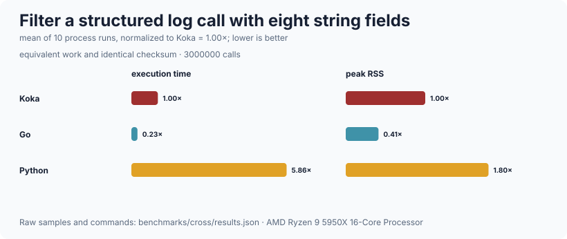
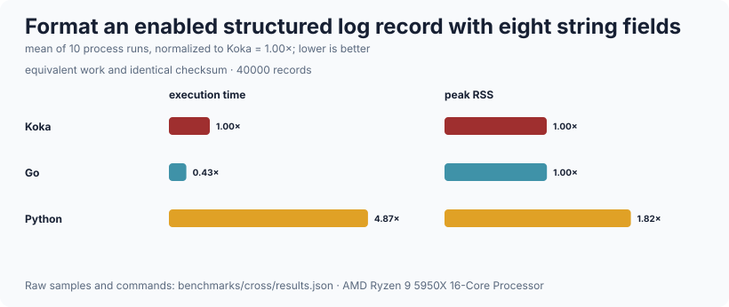

# logging

Structured logging as an effect, with a line-delimited JSON handler.  The
application-facing API is an effect, so a request handler says *what* happened
and the handler installed at the edge decides where it goes and what context it
carries — which is what makes a request id automatic instead of a parameter
threaded through every function.  Records are rendered as one JSON object per
line, and where the line goes is the `emit` parameter's business: nothing here
writes to a stream by itself.  It is deliberately *not* an observability stack:
there is no distributed tracing, no metrics, no sampling, no log rotation, no
syslog or journald sink, no asynchronous or buffered writer, and no way to
attach a value that is not already a string.

## Public API

| declaration | signature | what it is |
| --- | --- | --- |
| `logger` | `effect { fun log-record(lvl, message, fields) : (); fun log-base-fields() : list<field> }` | The effect.  `log-record` is the only operation that emits; everything else is sugar |
| `level` | `type { Debug; Info; Warn; Error }` | |
| `show` | `(l : level) : string` | `"debug"`, `"info"`, `"warn"`, `"error"` |
| `severity` | `(l : level) : int` | 10 / 20 / 30 / 40, so levels compare numerically |
| `field` | `alias = (string, string)` | A contextual field.  Values are strings: a log line is text, and making the caller render means no surprise formatting at the edge |
| `field` | `(name : string, v : int) : field` | Qualify as `int/field` |
| `field` | `(name : string, v : bool) : field` | Qualify as `bool/field`; renders `"true"` / `"false"` |
| `log` | `(lvl : level, message : string, fields : list<field> = []) : <logger\|e> ()` | |
| `debug` / `info` / `warn` / `error` | `(message : string, fields : list<field> = []) : <logger\|e> ()` | |
| `with-json-logger` | `(emit : (string) -> <io\|e> (), action : () -> <logger,io\|e> a, min : level = Info, base-fields : list<field> = [], now : () -> <io\|e> int = default-clock) : <io\|e> a` | Emit line-delimited JSON through `emit`, dropping anything below `min` |
| `with-context` | `(extra : list<field>, action : () -> <logger\|e> a) : <logger\|e> a` | Add fields to every record `action` produces |
| `with-min-level` | `(min : level, action : () -> <logger\|e> a) : <logger\|e> a` | Raise the minimum for a nested region while retaining the outer destination |
| `redact-fields` | `(fields, names, replacement = "[REDACTED]") : div list<field>` | Replace matching values without reordering fields |
| `with-redaction` | `(names, action, replacement = "[REDACTED]") : <logger,div\|e> a` | Redact call-site and nested-context fields in a region |
| `with-no-logger` | `(action : () -> <logger\|e> a) : e a` | Discard everything.  For tests that exercise a path without caring about output |
| `render` | `(lvl : level, message : string, fields : list<field>, at : int) : div string` | One record as one JSON object, without a handler |
| `default-clock` | `() : <io\|e> int` | Milliseconds since the epoch |

## Determinism

Fields are emitted in the order given, with the handler's own fields first.  A
record renders as

```json
{"level":"info","ts":1700000000000,"msg":"request","method":"GET","path":"/items/42","status":"200"}
```

Note `"status":"200"`, with the quotes: `ts` is the only numeric value a
record ever carries, because a `field` is a pair of strings and `int/field`
renders the number rather than embedding it.  Keys are never reordered, so
output is diffable.  The timestamp is the only non-deterministic part, and
`with-json-logger` takes the clock as a parameter so a test can pin it and
assert on whole lines.

Nesting is what a server uses: the outer handler holds the service name and the
per-connection handler adds the request id.  `with-context` is an `override`
handler, so an inner context's fields come before the ones the call site
passes, and the outer handler's `base-fields` come before both.

## Complexity

| operation | cost |
| --- | --- |
| `log` / `info` / … below `min` | O(1) — the record is never rendered |
| `render` with `k` fields totalling `m` characters | O(m + k), one pass through `strbuilder` |
| `with-context` | O(1) to install, O(k) per record to prepend `k` fields |
| `with-min-level` | O(1) per record |
| `with-redaction` with `k` fields and `r` names | O(k·r) per record |
| `with-json-logger` | O(1) to install; each record costs one `render` plus one `emit` |
| `log-base-fields` under `d` nested contexts | O(d) — each `override` appends to what the one outside it returned |

Measured on this machine (AMD Ryzen 9 5950X, 32 threads, 126 GiB, Linux 7.0.1
x86_64, Koka 3.2.7, `--release`, fastest of 3), with an `emit` that counts
octets rather than writing anywhere:

| what | n | ms | units/s |
| --- | ---: | ---: | ---: |
| `render`, 0 fields | 500 000 | 286 | 1 748 251 |
| `render`, 8 fields | 500 000 | 1 925 | 259 740 |
| `info` through the JSON handler, 0 fields | 500 000 | 282 | 1 773 049 |
| `info` through the JSON handler, 8 fields | 500 000 | 1 964 | 254 582 |
| `info` through `with-no-logger`, 8 fields | 500 000 | 12 | 41 666 666 |

Three things fall out of that.  The effect dispatch is nearly free — 24 ns per
call through a discarding handler, and the JSON rows are within 2% of calling
`render` directly.  The cost is entirely in rendering: a bare record is about
570 ns, and eight fields take it to about 3.9 µs.  And a *dropped* record —
below `min` — costs the no-op row, not the rendering row, because the handler
checks the severity before it renders.

Eight fields costing 3.3 µs more than none is more than it should be.  Each
field is two `append-json-string` calls, and `append-json-escaped` walks the
string as a character list, allocating as it goes.  A per-request log line at
that price is fine; a debug line per loop iteration is not.

Reproduce with `./run-benchmarks.sh logging` from the repository root.

### Across languages





The suite measures both minimum-level rejection and enabled structured-record
rendering with the same eight fields. See the
[ten-run time/RSS methodology](../benchmarks/cross/README.md).

## Worked example

```koka
import logging/log

// A handler function says what happened.  It does not know or care where the
// line goes, and it does not thread a logger through its arguments.
fun handle-request( path : string ) : <logger,io> int
  info("request received", [("path", path)])
  if path == "/boom" then
    error("handler failed", [("reason", "deliberate")])
    500
  else
    info("request served", [int/field("status", 200)])
    200

fun main()
  // The edge decides the destination, the minimum level, and the base fields.
  // `now` is fixed here so the output is byte-for-byte reproducible.
  with-json-logger(fn(line) println(line),
                   { with-context([("request-id", "r1")])
                       { handle-request("/items/42") }
                     with-context([("request-id", "r2")])
                       { handle-request("/boom") }
                     () },
                   Info,
                   [("service", "example")],
                   { 1700000000000 })

  // Debug is below the default minimum, so this renders nothing at all.
  with-json-logger(fn(line) println(line),
                   { debug("not emitted", []) },
                   Info, [], { 1700000000000 })

  // Local policy composes with the same destination and context.
  with-json-logger(fn(line) println(line), {
    with-min-level(Warn, { info("dropped"); warn("kept") })
    with-redaction(["token"], { info("login", [("token", "secret")]) })
  })
```

## Limits

* **Field values are strings.**  There is no `json`-valued field, so a nested
  object has to be rendered by the caller.  `int/field` and `bool/field` are
  the only conveniences.
* **Redaction is name-based and scoped.** `with-redaction` covers fields
  supplied by calls and inner `with-context` handlers. It cannot rewrite the
  destination handler's own `base-fields`, which are outside the scoped
  override; secrets should not be configured there.
* **Rendering costs about 3.9 µs for a record with eight fields.**  That is one
  log line per request, not one per loop iteration.  See the numbers above and
  `strbuilder`'s note about `append-json-escaped`.
* **`emit` is synchronous.**  It runs on the caller's stack, so a slow
  destination slows the caller down.  There is no buffering, no batching, and
  no background writer, which also means nothing is lost on a crash that a
  buffer would have swallowed.
* **No log rotation and no file sink.**  The one default in this tree is
  `http/server`'s `default-log-config`, which writes to **stdout**.
* **A task cannot inherit an ambient `logger`.**  `runtime/task`'s `spawn`
  fixes a task's effect row to `<async|io>`, so `http/server` takes the logging
  configuration as plain values and installs the handler *inside* each
  connection task, where the row is under its control.
* **`min` is checked at the handler, not at the call site.**  A dropped record
  still costs the effect operation — about 24 ns — and still evaluates its
  `fields` argument, so building an expensive field list for a debug line costs
  something even when the line is discarded.
* **No tracing and no metrics.**  Out of scope, deliberately.
