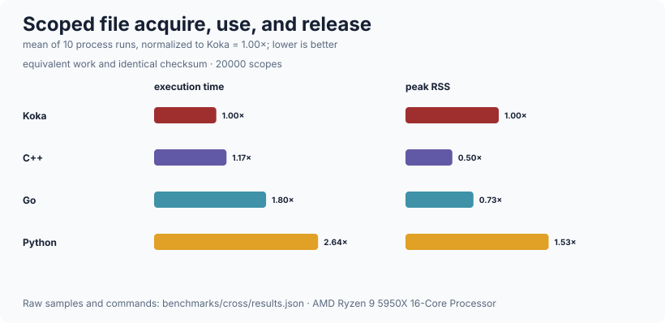

# resource

Scoped acquire / use / release: one place where release ordering and failure
handling are decided, so that every native resource in this program — files,
sockets, database connections, prepared statements, timers — is released the
same way.  Release runs exactly once and on every exit path, including the one
where an outer handler discards the continuation.  It is deliberately *not* a
lifetime system: nothing stops a caller stashing the resource somewhere and
using it after the scope ends (`owned` turns that into a thrown exception
rather than a use-after-free, which is as far as a library can go).  It is also
not an async resource manager — see the limits below, and `runtime/task`'s
`defer` for the version that works across a suspension point.

## Public API

| declaration | signature | what it is |
| --- | --- | --- |
| `with-resource` | `(acquire : () -> e a, release : (a) -> e (), action : (a) -> e b) : e b` | The primitive.  Fully polymorphic in the effect row |
| `with-owned` | `(acquire : () -> io a, release : (a) -> io (), action : (owned<a>) -> io b) : io b` | A handle that can be released *early* |
| `owned<a>` | `struct { value : a; release-action : (a) -> io (); released : ref<global, bool> }` | |
| `is-released` | `(h : owned<a>) : io bool` | |
| `release-owned` | `(h : owned<a>) : io ()` | Release now.  Idempotent |
| `with-value` | `(h : owned<a>, action : (a) -> io b) : io b` | Use it; throws if already released |
| `get` | `(h : owned<a>) : io a` | The resource itself, for callers that have already checked |
| `scope` | `struct { entries : ref<global, list<() -> io ()>> }` | A scope holding several resources |
| `with-scope` | `(action : (scope) -> io a) : io a` | Run `action` in a fresh scope; everything acquired in it is released on exit |
| `acquire` | `(s : scope, get-it : () -> io a, release : (a) -> io ()) : io a` | Acquire inside a scope |
| `acquire-owned` | `(s : scope, get-it : () -> io a, release : (a) -> io ()) : io owned<a>` | Acquire into a scope with early release and use-after-release checks |
| `on-exit` | `(s : scope, action : () -> io ()) : io ()` | Register a scope-exit action without acquiring anything |

Use `with-resource` when the number of resources is known and fixed — nested
`with-` forms read better.  Use `with-scope` when it is not, such as a request
handler that opens a statement per query.

## Guarantees

| exit path | released |
| --- | --- |
| normal return | yes |
| exception | yes |
| an outer handler discarding the continuation | yes |
| partial initialisation inside a scope | yes, for whatever was acquired |
| nested scopes | inner first, then outer |
| several resources in one scope | reverse acquisition order |

The mechanism is `finally`, whose handler is `final ctl`: it runs when the
computation ends *for any reason*, including a handler that never resumes.

Releases within one scope are nested inside each other with `finally`, so
**every** release runs even if an earlier one throws.  If a release throws while
the stack is already unwinding from another failure, the release's exception is
the one the caller sees — the same rule as `finally` in most languages.  Keep
release actions failure-free where the original error matters; the native
wrappers in this tree do, by ignoring close errors on resources that are
already broken.

`with-resource` and `with-scope` never discharge an effect they then re-raise.
That matters because Koka only subsumes *closed* effect rows: an implementation
written in terms of `try` would work at one fixed effect and could not sit
under a cancellation handler.

## Complexity

| operation | cost |
| --- | --- |
| `with-resource` | O(1) — one `finally` frame |
| `with-owned` | O(1) — one `finally` frame plus one `ref` |
| `acquire` in a scope | O(1) — a cons onto the entry list |
| `acquire-owned` in a scope | O(1) — one `ref` plus a registered idempotent release |
| `with-scope` exit, `k` resources | O(k) time, and **O(k) stack**: the releases are nested `finally` frames |

Measured on this machine (AMD Ryzen 9 5950X, 32 threads, 126 GiB, Linux 7.0.1
x86_64, Koka 3.2.7, `--release`, fastest of 3).  Every row does two million
acquire/release pairs, so these are directly comparable:

| what | n | ms | units/s |
| --- | ---: | ---: | ---: |
| acquire/release by hand, no scope | 2 000 000 | 5 | 400 000 000 |
| `with-resource` | 2 000 000 | 21 | 95 238 095 |
| `with-owned` | 2 000 000 | 69 | 28 985 507 |
| `with-scope` of 1k, n = acquisitions | 2 000 000 | 69 | 28 985 507 |
| `with-scope` of 10k, n = acquisitions | 2 000 000 | 79 | 25 316 455 |
| `with-resource` nested 8 deep | 2 000 000 | 33 | 60 606 060 |
| `with-resource` nested 32 deep | 2 000 000 | 32 | 62 500 000 |

`with-resource` costs about 8 ns per acquire/release over doing it by hand, and
`with-owned` about 32 ns — the extra is the `ref` for the released flag.
Nesting is free: 32 deep costs the same per operation as 8 deep.  A scope costs
about the same as `with-owned`.  At the scale a request handler works at, none
of this is on any critical path.

Reproduce with `./run-benchmarks.sh resource` from the repository root.

### Across languages



Each implementation repeatedly opens a file, reads one byte, and releases the
handle using its standard scoped-lifetime idiom. See the
[ten-run time/RSS methodology](../benchmarks/cross/README.md).

## Worked example

```koka
import resource/scope

// A resource that says when it is acquired and released.
fun open-thing( name : string ) : io string
  println("open " ++ name)
  name

fun close-thing( name : string ) : io ()
  println("close " ++ name)

fun main()
  // Nested `with-resource`: released inner first, on every exit path.
  with-resource({ open-thing("outer") }, close-thing) fn(_outer)
    with-resource({ open-thing("inner") }, close-thing) fn(_inner)
      println("working")

  // A scope, when the number of resources is decided at run time.
  with-scope fn(s)
    ["a", "b", "c"].foreach fn(n)
      s.acquire({ open-thing(n) }, close-thing)
      ()
    s.on-exit({ println("scope is done") })
    println("all three are open")
  // -> closed c, b, a, after "scope is done"

  // Dynamic acquisition can still return an individually releasable handle.
  with-scope fn(s)
    val h = s.acquire-owned({ open-thing("dynamic") }, close-thing)
    h.with-value(fn(n) println("using " ++ n))
    h.release-owned // scope exit is now a no-op for this handle

  // An owned handle, for a resource that must be released early.
  with-owned({ open-thing("early") }, close-thing) fn(h)
    h.with-value(fn(n) println("using " ++ n))
    release-owned(h)
    println("released: " ++ h.is-released.show)
    // a second release is a no-op, and scope exit will not release it again
```

## Limits

* **`finally` cannot span a suspension point in the task runtime.**  When the
  scheduler's handler captures a continuation and returns without resuming,
  Koka treats the computation as abandoned and runs `finally` handlers
  immediately — which for a `with-resource` around a socket read means

  ```
  acquire, release, <the task is still running>, ..., release
  ```

  a use-after-close followed by a double-close.  Inside a task, use
  `runtime/task`'s `defer` / `with-async-resource` (and the `with-socket` and
  `with-connection` wrappers built on them).  `finally` is still correct inside
  a task for regions that do not suspend.  `runtime/task`'s scheduler uses
  `rawctl` rather than `ctl` precisely so that this is a rule about *where* you
  may use `finally` rather than a rule that it is broken everywhere.
* **A scope's releases are stack frames.**  `release-all` nests each release
  inside the next with `finally`, so a scope holding tens of thousands of
  resources overflows the stack rather than unwinding.  Measured on this
  machine with the default 8 MiB stack (`ulimit -s 8192`), a scope of 40 000
  resources releases cleanly and one of 50 000 segfaults.  Nothing in this tree
  comes near that — a request handler holds a handful — but a program that
  wants a scope of that size needs a different release loop, and an iterative
  one would change which exception a caller sees when several releases throw.
* **`owned` detects use-after-release, not use-after-scope-exit.**  `get` and
  `with-value` throw on a released handle, so an escaped `owned` fails loudly.
  A plain `with-resource` gives you the raw resource, and nothing stops it
  outliving the scope.
* **`is-released`, not `!h.released`.**  On a `:ref` the prefix `!` is a
  dereference, so the negation reading is exactly backwards.  The accessor
  exists so the call site cannot be misread.
* **`owned` and `scope` are fixed to `io`** because both hold mutable state.
  Only `with-resource` is polymorphic in the effect row.
* **Release ordering across *separate* scopes is nesting order**, which is
  usually what you want, but it means two independent resources acquired in one
  scope are released in reverse of the order you happened to write them.
