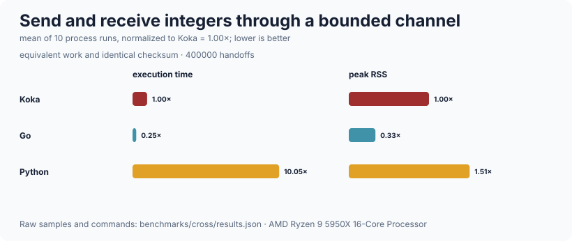

# runtime

The libuv event loop, structured task groups with cancellation, timers, TCP,
DNS, and bounded channels.  The `async` effect has one primitive — suspend the
current task until a named event-loop request completes — and everything else
(sleep, timeout, race, socket read) is written in terms of that plus `spawn`.
The scheduler is an effect handler: `await-requests` captures its continuation
and files it under the request id, the run loop drives libuv, drains
completions and resumes the matching continuations.  Tasks are cooperative and
single threaded, so no task is preempted between two statements and there are
no data races by construction.  It is deliberately *not* a general async
runtime: there is no multi-threading, no work stealing, no `detach`, no UDP, no
TLS, no file I/O on the loop, no process spawning, no signal handling, and no
select over arbitrary futures.

## Public API

### `runtime/task` — tasks, cancellation, timeouts

| declaration | signature | what it is |
| --- | --- | --- |
| `async` | `div effect { ctl await-requests(requests) : wakeup; ctl spawn-task(body); ctl yield-now(); ctl cancel-requested() : bool; ctl defer(action) }` | The effect |
| `wakeup` | `type { Completed(result : completion); Cancelled }` | What a suspended task is resumed with |
| `with-task-group` | `(body : (task-group) -> <async\|io> a) : io a` | Run `body` as the root task of a fresh group |
| `task-group` | `struct { state : sched }` | A handle, for cancelling from inside |
| `cancel` | `(g : task-group) : io ()` | Ask every task in the group to stop |
| `is-cancelling` | `(g : task-group) : io bool` | |
| `cancellation-requested` | `() : <async\|io> bool` | Has *this* task been asked to stop?  A long computation should check it, since a task that never suspends is never interrupted |
| `spawn` | `(body : () -> <async\|io> ()) : <async\|io> ()` | Start a sibling in the current group |
| `yield` | `() : <async\|io> ()` | Give other ready tasks a turn.  Also a cancellation check point |
| `sleep` | `(ms : int) : <async\|io> ()` | Cancellable |
| `await` | `(req : int) : <async\|io> completion` | Wait for a request, turning cancellation into an exception |
| `await-within` | `(req : int, ms : int) : <async\|io> maybe<completion>` | A real race between the request and a timer, not a poll.  `Nothing` means the deadline passed |
| `with-async-resource` | `(acquire, release : (a) -> io (), action) : <async,io\|e> b` | The async equivalent of `with-resource`; releases when the *task* ends |
| `throw-cancelled` | `() : <async\|io> a` | |
| `is-cancellation` | `(ex : exception) : bool` | |
| `ExnCancelled` | `extend type exception-info` | Cancellation is carried in the exception's *info*, not its message |
| `cancelled-message` | `: string` | |

### `runtime/net` — TCP and DNS

| declaration | signature | what it is |
| --- | --- | --- |
| `socket` / `listener` | `value struct { id : int }` | Integer ids; raw handles never leave `runtime/loop` |
| `listen` | `(host : string = "127.0.0.1", port : int = 0, backlog : int = 128) : io listener` | Port 0 asks the OS for a free port.  Qualify as `net/listen` |
| `port` | `(l : listener) : io int` | Which port was actually bound.  Raises if it cannot be determined, rather than returning the `-1` a caller would go on to print in a URL |
| `close` | `(l : listener) : io ()` | Qualify as `listener/close` |
| `with-listener` | `(action : (listener) -> io a, host, port, backlog) : io a` | |
| `accept` | `(l : listener) : <async\|io> socket` | Cancellable |
| `accept-within` | `(l : listener, ms : int) : <async\|io> maybe<socket>` | Clears the armed accept when the deadline wins, or the next arm fails with `EBUSY` |
| `connect` | `(host : string, port : int) : <async\|io> socket` | Qualify as `net/connect` |
| `with-connection` | `(host, port, action : (socket) -> <async,io\|e> a) : <async,io\|e> a` | |
| `read` | `(s : socket, max : int = 65536) : <async\|io> bytes` | Empty means the peer closed |
| `read-within` | `(s : socket, ms : int, max : int = 65536) : <async\|io> maybe<bytes>` | |
| `write` | `(s : socket, data : bytes) : <async\|io> ()` | libuv queues the whole buffer, so partial writes are not the caller's problem |
| `write-string` | `(s : socket, text : string) : <async\|io> ()` | |
| `close` | `(s : socket) : io ()` | Idempotent.  Qualify as `socket/close` |
| `is-open` / `peer` | `(s : socket) : io bool` / `io string` | |
| `with-socket` | `(s : socket, action : (socket) -> <async,io\|e> a) : <async,io\|e> a` | Closes when the current task ends |
| `resolve` | `(host : string) : <async\|io> string` | One IPv4 address.  Cancellable |

### `runtime/channel` — bounded channels

| declaration | signature | what it is |
| --- | --- | --- |
| `channel` | `(capacity : int = 16) : io channel<a>` | Capacity must be at least 1; there is no unbounded constructor |
| `send` | `(c : channel<a>, x : a) : <async\|io> ()` | Suspends while full.  Raises on a closed channel |
| `receive` | `(c : channel<a>) : <async\|io> maybe<a>` | `Nothing` means closed *and* drained |
| `try-receive` | `(c : channel<a>) : io maybe<a>` | Without waiting |
| `count` / `is-full` | `(c : channel<a>) : io int` / `io bool` | |
| `close` | `(c : channel<a>) : io ()` | Buffered items stay available; every waiter is woken |

### `runtime/loop` — the event loop

The only module that touches libuv.  It exposes request ids and completions;
no raw native handle leaves it, and libuv callbacks never call into Koka — they
append to a completion queue that `next-completion` drains.  `loop-init`,
`loop-shutdown`, `fresh-request`, `now-ms`, `run-once`, `pending`,
`live-timers`, `next-completion`, the `arm-*` family, `cancel-timer`,
`cancel-accept`, `cancel-read`, `listen`, `connect`, `bound-port`,
`peer-address`, `close-stream`, `close-listener`, `is-open`, `strerror`, and
the `completion` struct (`request`, `status`, `value`, `data`, `text`).
Everything above is written against `arm-*` plus `next-completion`; a caller
normally does not need this module directly.

Failures are values rather than prose.  `error(c) : maybe<uv-error>` is
`Nothing` on success — where the earlier `error-message` returned `""`, which
is also what a failure carrying an empty message produced — and `uv-error`
keeps the numeric `status` next to its `message`.  `throw-uv` and `check-uv`
raise with that status in the exception's *info*, as `ExnUv(status)`, so a
caller can tell an `ECANCELED` from an `ECONNRESET` by matching on it instead
of searching a string that was assembled for a human.  `bound-port` returns
`either<uv-error,int>` for the same reason: one `-1` used to stand for "no such
stream", "getsockname failed" and "not an IPv4 socket" alike.

`cancel-timer` stops a timer that has not fired.  `await-within` calls it on
whichever way its race ends, because the deadline normally *loses*: without it
every timed socket read left a live `uv_timer_t` for the whole timeout — at
`http/server`'s 30 s idle timeout, one per request — which then fired a
completion no task was parked on.  `live-timers` exists so that property can be
asserted in a test rather than assumed.

## Structure and cancellation

> A child task does not outlive its scope.

`with-task-group` returns when the *root* task — the body — is done.  Any
sibling still running at that point is **cancelled and then awaited**, not
joined: a task doing useful work when the body returns is stopped, it does not
get to finish.  Spawn work you need the result of and await it, rather than
assuming the group will wait.

Cancellation is *not* an exception: it is a flag plus a rule.  A cancelled task
is resumed one last time with `Cancelled`, and every suspension point turns
that into a `cancelled` exception, which unwinds through `finally` and
therefore through every `resource/scope` release.  A task already suspended on
a socket read is woken because closing the stream completes its pending
request.

A task that throws records its exception in the group.  When the group
finishes, the first recorded failure is re-raised in the parent, after every
sibling has been cancelled and awaited — so a failure cannot be lost and cannot
leave siblings running.

## Complexity

| operation | cost |
| --- | --- |
| `yield` | O(1) plus one scheduler turn |
| `sleep`, `await` | O(1) to arm, plus one trip through the event loop |
| `await-within` | as `await`, plus one extra timer |
| `spawn` | O(ready) — the ready queue is a list appended to at the tail |
| `unpark` on a completion | O(waiting) — the wait list is scanned twice |
| `send` / `receive` | amortised O(1) — the channel buffer is a two-list queue |
| `count` / `is-full` | O(1) — the buffer's size is kept, not counted |
| group teardown | O(ready + waiting) per round, bounded at 10 000 rounds |

Measured on this machine (AMD Ryzen 9 5950X, 32 threads, 126 GiB, Linux 7.0.1
x86_64, Koka 3.2.7, `--release`, fastest of 3):

| what | n | ms | units/s |
| --- | ---: | ---: | ---: |
| `yield` | 200 000 | 117 | 1 709 401 |
| `yield` | 800 000 | 465 | 1 720 430 |
| `sleep(0)` (arm timer + park) | 20 000 | 22 | 909 090 |
| `sleep(0)` (arm timer + park) | 80 000 | 90 | 888 888 |
| `spawn` a task that returns | 50 000 | 33 | 1 515 151 |
| `spawn` a task that returns | 200 000 | 132 | 1 515 151 |
| channel send + receive, capacity 16 | 20 000 | 6 | 3 333 333 |
| channel send + receive, capacity 32k | 20 000 | 2 | 10 000 000 |

A yield costs about 590 ns, a `sleep(0)` about 1.1 µs — the difference is the
round trip through libuv — and a spawn about 670 ns.  All three are flat in
`n`, so nothing there is quadratic at these sizes.

The last pair is the one to read carefully, and it used to be the bad news.
The two channel rows differ only in capacity: at 16 the buffer never holds more
than 16 items, and at 32 768 it holds everything that has been sent.  When
`send` appended with `items ++ [x]` — O(length) — and `is-full` measured the
buffer with `length`, the wide row cost **1 861 ms against the narrow row's
6 ms, 310 times slower**, because the same 20 000 hand-offs were O(n²).  The
buffer is now a two-list queue with its size kept alongside, so both are
amortised O(1) and the wide row is 2 ms: the *narrow* row is now the slower of
the two, and for the right reason — a channel at its capacity parks the
producer, and each park is a round trip through the event loop.

Reproduce with `./run-benchmarks.sh runtime` from the repository root.

### Across languages



Each implementation sends and receives the same integer sequence through a
buffered channel and prints the same checksum. See the
[ten-run time/RSS methodology](../benchmarks/cross/README.md).

## Worked example

```koka
import runtime/loop
import runtime/task
import runtime/net
import runtime/channel

fun main()
  with-task-group fn(g)
    // A producer and a consumer, connected by a bounded channel.  `send`
    // suspends when the buffer is full, which is the backpressure.
    val work : channel<int> = channel(4)
    spawn fn()
      fun produce( i : int ) : <async|io> ()
        if i >= 10 then work.close else { work.send(i * i); produce(i + 1) }
      produce(0)

    fun consume( total : int ) : <async|io> int
      match work.receive
        Just(x) -> consume(total + x)
        Nothing -> total
    println("sum of squares: " ++ consume(0).show)

    // A timeout is a race, not a poll: the task parks on both ids at once.
    val req = fresh-request()
    val rc  = arm-timer(req, 50)
    if rc != 0 then throw("cannot start a timer")
    match await-within(req, 5)
      Nothing -> println("the 5 ms deadline won, as expected")
      Just(_) -> println("the 50 ms timer won, which would be surprising")

    // Cancelling the group stops every task at its next suspension point.
    spawn fn() { sleep(10000); println("never reached") }
    yield()
    g.cancel
```

## Tests

The package test suite exercises `runtime/loop` directly as well as through
`runtime/task` and `runtime/net`: request-id monotonicity, completion queue
draining, timer cancellation, structured libuv failures, listener kind safety,
and cancel/re-arm behavior are pinned at the primitive boundary.

## Limits

* **Nothing may busy-wait.**  `run-loop` drains libuv completions only when the
  ready queue is empty, so a task that waits for a sibling by looping on
  `yield` keeps itself ready forever, the loop is never driven, and the sibling
  parked on a completion is never woken: the program livelocks rather than
  finishing slowly.  Wait by parking — receive from a channel, await a request
  — which is what a task is supposed to do anyway.
* **`finally` cannot span a suspension point.**  Use `defer` /
  `with-async-resource` (and `with-socket`, `with-connection`) inside a task.
  See `resource`'s README for the double-release this avoids.
* **Cancellation is cooperative.**  A task that never reaches a suspension
  point cannot be cancelled.  `cancellation-requested()` is there for long
  computations; nothing forces them to call it.
* **Draining gives up after 10 000 rounds.**  A task parked at that point never
  runs its cleanups.  The alternative to giving up is hanging forever.  It is a
  known limitation, not a guarantee.
* **The ready queue is a tail-appended list**, so a push is O(ready).  In
  practice the queue holds a handful of entries — the scheduler runs one task
  to its next suspension point before taking the next — which is why `spawn` is
  flat in `n` above.  The channel buffer used to have the same shape and was
  not flat; it is now a two-list queue.
* **There is no `detach`.**  A sibling still running when the root returns is
  cancelled, not left to finish.
* **Single threaded, single loop.**  There is exactly one loop, `loop-init` is
  idempotent, and nothing here uses more than one core.
* **IPv4 only** in `resolve`, and no UDP, no TLS, no unix sockets.
* **The libuv completion queue has no explicit cap.**  It is bounded in
  practice by the number of outstanding requests, which `http/server`'s limits
  bound in turn — but this package on its own does not bound it.
